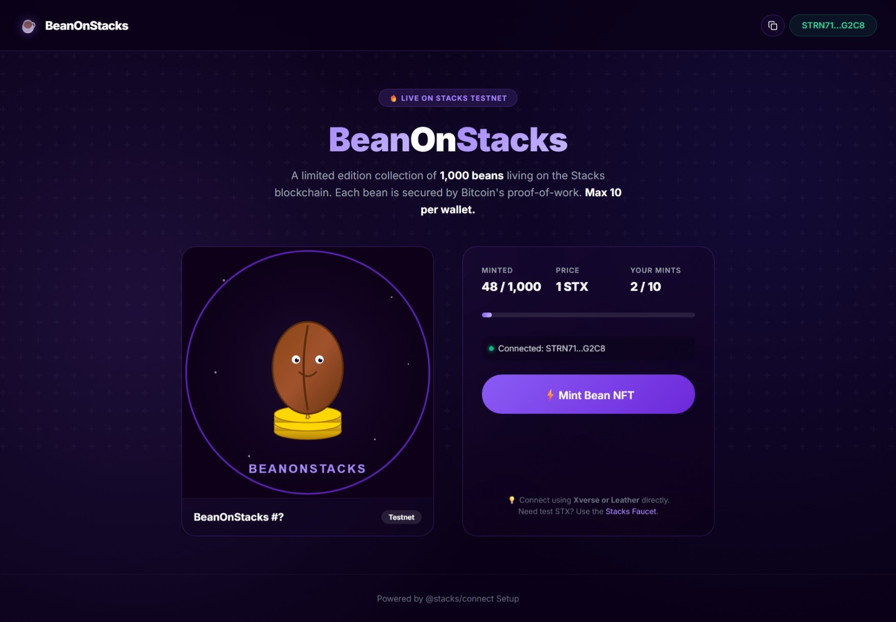

# BeanOnStacks NFT DApp

A premium, modern React application for minting limited-edition SIP-009 **BeanOnStacks** NFTs on the Stacks blockchain. Secured by Bitcoin's proof-of-work.



---

## Features

- **Decentralized Minting**: Directly interacts with the `bean-nft.clar` smart contract on the Stacks Testnet.
- **Wallet Integration**: Native integration with `@stacks/connect` supporting Xverse, Leather, and other Stacks browser extensions.
- **Dynamic Live Stats**: Fetches the total minted supply directly from the blockchain on load.
- **Mint Limits Enforcement**: Reads the connected wallet's principal ID to display personal mint counts and permanently lock the minting button at the 10 NFT maximum limit.
- **Live Transaction Tracking**: Seamlessly generates and links users directly to the Hiro Explorer transaction hash upon initiating a mint.
- **Mobile Responsive & Premium UI**: A highly polished, dynamic gradient dark-theme interface built with vanilla CSS.

## Tech Stack

- **Frontend Framework**: [React 18](https://react.dev/) + [Vite](https://vitejs.dev/) + [TypeScript](https://www.typescriptlang.org/)
- **Blockchain Network**: [Stacks Testnet](https://www.stacks.co/)
- **Web3 Integration**: 
  - `@stacks/connect` & `@stacks/connect-react` for wallet authentication
  - `@stacks/transactions` for serialization, Principal CV typing, and RPC API calls
- **Styling**: Vanilla CSS with modern `@media` responsive queries

## Getting Started

### Prerequisites
- Node.js (v18 or higher)
- A Stacks Wallet Browser Extension (e.g., [Xverse](https://www.xverse.app/) or [Leather](https://leather.io/)) fully configured on the Stacks Testnet.

### Installation

1. Clone the repository:
   ```bash
   git clone https://github.com/Wizbisy/bean-on-stacks.git
   cd bean-on-stacks
   ```

2. Install dependencies:
   ```bash
   npm install
   ```

3. Start the development server:
   ```bash
   npm run dev
   ```

4. Open your browser and navigate to `http://localhost:5173`.

## Build for Production

To generate an optimized bundle for deployment (Vercel, Netlify, GitHub Pages, etc.), run:
```bash
npm run build
```
This outputs all static files securely translated alongside CSS into the `dist/` directory.

## Smart Contract

The core application interacts with a **SIP-009 Non-Fungible Token Standard** contract.
- **Contract Name**: `bean-nft`
- **Network**: Stacks Testnet
- **Address**: `ST15T00TRYSEM32RXVWMCNQD8QFS1B2856XR5Q43V`

---
